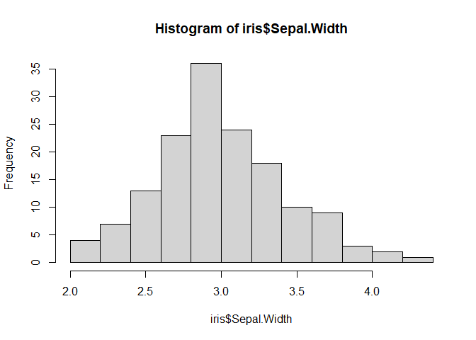
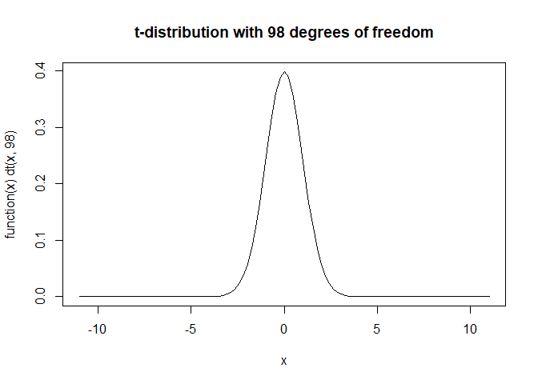

# Introduction

Welcome to your first IB 372 lab!  

In this lab we'll be going over introductory statistics, a topic that will set you up for the data analysis and interperitation you'll be doing throughout the semester and throughout your careers in just about any field going forward.  

We'll go over two major types of statistics, **descriptive** statistics, and **inferential** statistics, as well as covering the basics of how to read data into R, and explore that data with these statistics.  

By the end of this lab, you should be able to apply the described descriptive and inferential statistics to a data set, define common statstical terms, and be able to interperate the output of each analysis described here. For a detailed list of learning outcomes, check out the list at the end of this lab.

# Getting into a data set

For today's lab, you'll be using several data sets that you'll read into R from files we provide, but we'll start out demonstrating a few concepts with a data set provided with every R installation, first off let's use the data set called "iris"  

Because this data set is included with R, we can import it by just using the following code 


```r
#read in the data set called iris
data("iris")
```

This dataset contains measurements on individuals of three different iris species, and was first published by a famous biologist and statistician names Ronald Fisher

Let's get a look at what we actually have data on shall we?


```r
#the dim function tells us the dimensions of our data set, how many rows and columns of data we have
dim(iris)
```

```
## [1] 150   5
```

```r
#we use the head function to see the top few rows of a data set
head(iris)
```

```
##   Sepal.Length Sepal.Width Petal.Length Petal.Width Species
## 1          5.1         3.5          1.4         0.2  setosa
## 2          4.9         3.0          1.4         0.2  setosa
## 3          4.7         3.2          1.3         0.2  setosa
## 4          4.6         3.1          1.5         0.2  setosa
## 5          5.0         3.6          1.4         0.2  setosa
## 6          5.4         3.9          1.7         0.4  setosa
```

We can get a lot of usefull information about our data from just these two functions in R (a function in R is just like a function in your old math class, it's anything that takes one thing in, does something with it, and spits something else out)  

From the output of running dim on our data set, we can see that we have 150 rows of our data set, which corrospond to 150 iris **individuals**, and 5 columns of our data, which corrospond to 5 **variables**, or things that were measured  

This is where I type something super obvious that's important to keep in mind.  

If we take the entire global population of each of these species and count them, there would be more than 150 indviduals, because we're gouping based on species, we would call the group of all individauls of a given species of iris the **population** of that species. A population is just the total number of plants/animals/people that have an attribute of interest. A **parameter** is the real measure of this attribute for the population. We say there are **N** individuals when we're talking about a whole population.

Alternatively, our data set is a **sample** of each of those populations, a subset of the population for which a researcher measures the
attribute. This sample is assumed to be representative of the entire population. A **statistic** is a measure of the attribute for the sample. When we're talking about a sample we say there are **n** individuals.

So for our data set, n=150, it is a sample of the global iris population.

From the output of running head on our data set, we can see that the 5 variables included here are Sepal length, Sepal width, Petal length, Petal width, and species, if you're wondering why there are dots in the names of each variable, it's because including spaces in column names makes it harder to work with in R, keep that in mind as you collect your own data!

We can also see from our head function that we've got two different types of variables here, the first four columns are measurements of length or width. These are called **continuous** variables, they can be any value in an uninterupted range (if you picture a number line, they can be any value on there). Species on the other hand is not a continuous variable, let's see if there are any values other than setosa, which is all we see in the first few lines.


```r
#we use unique to get all the unique values in a set a of data
#the $ after iris tells R we want a column within that data set, in this case, species
unique(iris$Species)
```

```
## [1] setosa     versicolor virginica 
## Levels: setosa versicolor virginica
```

We see here that we've got three "levels" of this variable, but they aren't numbers like our other variables. This is what's called a **nominal discrete** variable, which just means a variable where only certain values are possible (the species of iris), and the options, or levels, don't have a meaninful order. If there were a meaningful order to our possible values, we would have an **ordered discrete** variable, which could be something like shoe size, it's a number, and each size fits into an order, however there are a limited number of possible values.

# Descriptive statistics

Now that we have a data set, and understand what we're looking at, let's start to get an idea of what our data look like quantiatively. When we're not looking to answer a specific, quantitative question, like "are the sepals of species A longer than the sepals of species B", then use what we call **descriptive** statistics, these are values like **mean**, **median**, and **mode**, that just give us a way to quantitatively describe our data.  

The best way to get started looking at a data set, is with just a simple histogram and R makes this really easy for us. Here we're going to make a histogram of our sepal width


```r
#the hist function allows us to draw a histogram of a data set
hist(iris$Sepal.Width)
```

<!-- -->

This is useful because it allows us to get a look at how our data is dstributed across the range of values represented, and give us a qualitiative idea of what we're looking at.  

As a brief, but important tangent, it's always important to keep in mind how you're visualizing your data, as well as what data your visualizing. With histograms the biggest factor to consider is, how are we breaking up our data, or how wide a range of values are we grouping together. This is important because if don't have enough groups we may clump too many individausl together and it can be hard to notice a pattern.


```r
#we can use the breaks argument in hist to tell it how many breaks we want in our histogram
hist(iris$Sepal.Width, breaks = 3)
```

<!-- -->

Here we don't break up our data enough and we miss out on the major structure of our data (that it's approximatly normally distributed, but we'll get to that soon!). Alternatively, if we break up our data too much, we can notice patterns that aren't particularly meaningful (this is a judgement call that you'll get better at as you spend more time with real data sets!).


```r
hist(iris$Sepal.Width, breaks = 45)
```

<!-- -->

Now we can see the same main pattern as we did in our original histogram, however we also see a lot more rises and drops from column to column. It doesn't take away too much from the main pattern in this case, but it can throw us off of a meaningful signal in our data when we have messier data sets. How many breaks you include in a histogram is your choice, but always try out a few different ways to break up your data to make sure you're getting a real signal and not missing anything!  

Now lets learn what values we can find for our data to start to understand what we're looking at!

## Measures of central tendeny

The first set of descriptive statistics we'll look at here are what are called **measures of central tendency**, which is really a fancy term for all the things your third grade math teacher called averages, we'll look at **mean**, **median**, and **mode**.

The most important of these values is the **mean**, which for a **population** is called $\mu$, and for a **sample** is called $\bar{x}$, you're all probobly fermiliar with the formula for mean, but as a refresher it's defined as the following for a sample:  
$$ \bar{x} = \frac{\sum_{i=1}^n x_i}{n} $$
Or, in english, just the sum of all the values devided by the number of values.

The **median** is just the middle value in a set of data, if you'r data is in order and you have an odd number of values, the median is just the value in the middle, or the $\frac{n+1}{2}th$ value, so $$ M_{odd} = x_\frac{n+1}{2}$$  
If you've got an even number of values, because you may not have one value in the middle, you take the average of the two numbers closest to the middle, so $$M_{even} = \frac{x_\frac{n}{2}+x_\frac{n+1}{2}}{2}$$

The **mode**, on the other hand, is the most common value in a data set.

For example, if we've got a data set of the values: $$1,1,1,1,4,5,6,6,7,7,7,8,9,10$$
then the **mean** = 5.214286
the **median** = 6
and the **mode** = 1

If our data are **normally** distributed, think a symetrical bell curve, the mean is just at the peak of a histogram of the data, to demonstrate that, here's a plot of some randomly simulated normal data, with a red line representing the mean.


```r
#first we generate a random dataset of 100000 values from a noramal distribution
#note that the <- assigns a value to a variable
x <- rnorm(100000)

#then we take it's mean
xBar <- mean(x)

#we draw a histogram of the data
hist(x, main = "Normal data with mean")

#and add a line to the plot where the mean is
abline(v=xBar, col="red", lwd=2)
```

<!-- -->

Interestigly, if the data is normal then the mode and median are also rigth in the middle where the highest frequency is, it takes a little buit of code that I'd rather not complicate things with for this example to get the mode of our data in R, so I'm going to leave out a plot with the mode, but here's one with the mdedian in blue


```r
#get the median of the data and assign it to xMed
xMed <- median(x)

#we draw a histogram of the data
hist(x, main = "Normal data with Median")

#and add a line to the plot where the median is
abline(v=xMed, col="blue", lwd=2)
```

<!-- -->

While measures of central tendancy don't tell us much about how our data are actually distributed, they can tell us if our data is **skewed**, basically just whether or not our data are perfectly semetrical. If our **mean, median, and mode are all equal**, then we know our data are symetrical and **not skewed** in the negative or positive direction, if our **mean is lower than our median and mode** then we call our data **negatively skewed**, and if our **mean is higher than our median and mode**, we say our data is **positively skewed**, don't worry too much about knowing the specifics of each of these terms, just know that not all data are symetrical, and if they aren't we say they're skewed.

That's all the measures of central tendancy you need to know, so now let's move on to measures of dispersion

## Measures of dispersion

While we can tell a lot from the mean, median, and mode of a data set, it's important to remember that they don't tell us everything about how our data is distributed across its **range** - $x_{max}-x_{min}$, for example, these three plots all have the same exact mean, median, and mode, but if you got these three data sets, you'd know something was different between them  


```r
#these are functions we use to randomly sample, and plot random normal data, don't worry about these functions for now, unless you want to! in which case, feel free to worry about them!
#least dispersion
x <- seq(-10, 10, length=1000)
y <- dnorm(x, mean=0, sd=.75)
plot(x, y, type="l", lwd=1)
```

<!-- -->

```r
#medium dispersion
x <- seq(-10, 10, length=1000)
y <- dnorm(x, mean=0, sd=2)
plot(x, y, type="l", lwd=1)
```

<!-- -->

```r
#most dispersion
x <- seq(-10, 10, length=1000)
y <- dnorm(x, mean=0, sd=3)
plot(x, y, type="l", lwd=1)
```

<!-- -->
You'd be right in thinking they are different because they all have different **standard deviations**  

**Standard deviation**, generally represented as $\sigma$ for a population or $s$ for a sample, is a measure of how spread out our data is, it's really useful for understanding the normal distrubution, which I'll talk about in just a second.  

While **standard deviation** is great, and has a straight forward interpritation, we rarely calculate it directly, it's actually easier to calculate the squared **standard deviation**, which we call **variance** ($\sigma^2$ for a population, or $s^2$ for a sample). The formula for variance is $$s^2=\frac{\sum_{i=1}^{n}(x_i-\bar{x})^2}{n-1}$$  
but we won't hold you responsible for having this memorized  

The reason **standard deviation** is so useful is it allows us to translate knowing that our data is normal, into knowing what proportion of our data is where, for example in a perfect, normal data set, we know that 68.2% of our data falls within one standard devation of the mean, a 95% chance it falls within 2 standard deviations ,and there's only a 0.2% chance of getting a value more than 3 standard deviations from the mean. Here are the same plots as above but with lines drawn in blue at one standard deviation out, in red at two standard deviations out, and in green at three standard deviations out.


```r
#least dispersion
x <- seq(-10, 10, length=1000)
y <- dnorm(x, mean=0, sd=.75)
y.stDev <- .75
plot(x, y, type="l", lwd=1)
abline(v=y.stDev, col="blue", lwd=2)
abline(v=-y.stDev, col="blue", lwd=2)
abline(v=2*y.stDev, col="red", lwd=2)
abline(v=-2*y.stDev, col="red", lwd=2)
abline(v=3*y.stDev, col="green", lwd=2)
abline(v=-3*y.stDev, col="green", lwd=2)
```

<!-- -->

```r
#medium dispersion
x <- seq(-10, 10, length=1000)
y <- dnorm(x, mean=0, sd=2)
y.stDev <- 2
plot(x, y, type="l", lwd=1)
abline(v=y.stDev, col="blue", lwd=2)
abline(v=-y.stDev, col="blue", lwd=2)
abline(v=2*y.stDev, col="red", lwd=2)
abline(v=-2*y.stDev, col="red", lwd=2)
abline(v=3*y.stDev, col="green", lwd=2)
abline(v=-3*y.stDev, col="green", lwd=2)
```

<!-- -->

```r
#most dispersion
x <- seq(-10, 10, length=1000)
y <- dnorm(x, mean=0, sd=3)
y.stDev <- 3
plot(x, y, type="l", lwd=1)
abline(v=y.stDev, col="blue", lwd=2)
abline(v=-y.stDev, col="blue", lwd=2)
abline(v=2*y.stDev, col="red", lwd=2)
abline(v=-2*y.stDev, col="red", lwd=2)
abline(v=3*y.stDev, col="green", lwd=2)
abline(v=-3*y.stDev, col="green", lwd=2)
```

<!-- -->

In addition to **range**, **standard deviation**, and **variance**,  it's also helpful to have an undersanding of **standard error**, while we won't spend much time on it here, standard error gives us a value to compare how well a sample mean estimates the population mean, it's value is 
$$\frac{s}{\sqrt{n}}$$  
so the larger our sample (n) the smaller our error is, and the higher our standard deviation (s), the larger it is

## Now with iris data!

Let's take what we've learned about descriptive statistics, and apply them to our sepal length data for our iris species!  

First, let's get measures of central tendancy. We'll foregoe mode here because we can get all the information we need here from our mean and median, and R can calculate them with build in functions


```r
#mean
mean(iris$Sepal.Width)
```

```
## [1] 3.057333
```

```r
#median
median(iris$Sepal.Width)
```

```
## [1] 3
```

You might be thinking, OH MY GOSH! OUR MEAN AND MEDIAN AREN'T EQUAL SO OUR DATA ISN'T NORMAL!!!!, HOW CAN WE USE ANY OF WHAT WE LEARN TODAY (spoiler alert, lots of what we learn today requires normal data) IF OUR DATA ISN'T NORMAL???, and you'd technically be right, having a mean and median that are different does mean our data is skewed, but the difference is so small it's effectively meaningless here, even with data much more skewed than this people offten assume normality, or if they can't will apply a function to their data to make it more normal, because a huge amount of the work done in statistics is on how to tell things about normal, or normalized data sets. 

We won't spend much time on them, but you should also be aware that there are statistical tests and inferences we can make based on data that isn't normalized (called non-parametric statistics), or based on data that fit other distributions (poisson, chi-squared, etc.). We'll focus on normal, or almost normal data here, because it makes the statistical tests we run much more straightforward!

Now that we know our data is approximately normal (we won't actaully run a formal test of this, we're basing it on the histogram and the approximately equal mean and median), we can move on to charecterize the dispersion of our data. 


```r
#range (min then max)
range(iris$Sepal.Width)
```

```
## [1] 2.0 4.4
```

```r
#variance
var(iris$Sepal.Width)
```

```
## [1] 0.1899794
```

```r
#standard deviation
#sd gives us standard deviation, but we assign it to a variable here so we can calculate standard error
standardDev <- sd(iris$Sepal.Width)
standardDev
```

```
## [1] 0.4358663
```

```r
#standardError (remember n=150 here)
standardDev/sqrt(150)
```

```
## [1] 0.03558833
```

Both the dispersion and centrality statistics of this data set are nice to have, but they don't let us answer any particularly interesting questions on their own. Remember that we're looking at data on three different iris species! Move to the lab 1 R markdown file to find the data split up by species, and try some of this out for yourself! After you finish that, come back here and we'll start to answer some questions with data!

# Inferential statistics

## Inference
Welcome back! Now that we've got a grasp on how we can get an idea of what our data looks like, we're going to dive into how we can actually draw conclusions about questions we're interested in based on that data, using a set of tools called **inferential statistics**.  

**Inference** is the process by which we draw conclusions about an unknown based on evidence or prior experience. As you might expect, **inferential statistics** is a set of tools we use to draw conclusions about a population based on a sampled from that population. Here is a great time to remember that all of these tools assume our sample is **representative** of our population, if we sample in a way that biases the data, our conclusions can be wrong or misleading with regards to the population as a whole.  

All inferential statistics are build to test a set of hypotheses, we refer to these as a **null** hypothesis, referred to as $H_0$ which states that the thing we're testing doesn't have an impact and an **alternative hypothesis**, referred to as $H_A$, that what we're testing DOES have an impact. You've probably heard these terms before, but in case you haven't don't worry, they'll get clearer with time!  

## Significance and some words of warning!

Inferential statistics allow us to test the **signifigance** of a pattern we see in our data given our null and alternative hypotheses. When folks talk about the signifigance of a result, they're really talking about how likely you would be to see the pattern in your data under the expectations of the null hypothesis. We call this probability a **p-value**, so for example, if p = 0.1, there's a 10% chance you'd get your result under the expectations of your null hypothesis. While it's not always clear how low a p-value needs to be to indicate a meaningful pattern in your data, a cutoff of 0.05, or a 5% chance of getting your data randomly under the null hypotheis, is generally used in scientific litterature.  

There are years of courses you could take on how we arive at specific p-values, if you'd like one I'd recommend prability theory over in the math department, and I'll talk a bit about how we get to them for the various tests we discuss, but we'll largely focus on building an intuition around these values and what they might mean for the science we're doing.  

Before we move on there are a few notes of caution about the things I just told you. First and foremost is to remember that **a p-value is a prability**, we cannot say for sure that our alternative, or null hypotheses are 100% true. Instead we say that we either **fail to reject the null hypothesis**, or that our results **do not support our alternative hypothesis**, remember we're using a limited data set with only one null hypothesis, it's entirely possible we either just didn't collect enough data to show our alternative hypothesis, or that some other process that we didn't test for is at work in our data, stats is all about bet hedging.  

Because there's always a chance our test gives us the incorrect result, we've got terms to identify when we either incorrectly support or reject $H_0$. **Type 1 error** is when we reject $H_0$ when $H_0$ is actually true (false positive). The probability of a type 1 error is denoted $\alpha$ and reffered to as the significance level of the test (not to be confused with the significance of our result). Alternatively **Type 2 error** is when we accept $H_0$, when $H_0$ is really false (false negative). The probability of type 2 error is denoted as $\beta$, and $1-\beta$ is reffered to as the **power** of a test. 

Finally (and then I promise we'll actaully get into some tests!) another important note is that your data **have to exactly, or almost exactly, meet the assumptions of the test you're doing!** If you're running a test that has the null expectation that your data are normal for example, on data that is nowhere near normal, then it's easy to get a significant result that really just means you ran the wrong test! Remember, in the background stats is just math, once you run a test all your computer is doing is math, it's up to you to make sure you check to see that the result of that math will be meaningful! There's a famous expression in stats, garbage in garbage out, if your data is bad or doesn't meet the assumptions of a test, then you'll get garbage out!  

## T-Tests  

A t-test is one of the most straight forward statistical tests, while also being one of the most useful in a lot of the contexts we'll be using stats in, so we'll start there!  
A **t-test** takes a set of normal data and determines how statistically significant the mean of that data set is from either a pre-defined value (one sample t-test), or the mean of another normal data set (two sample t-test).  
I'm a big fan of the Ms.Frizzle (any magic school buss fans out there?) way of learning, so before we dive too deep into the details of the t-test, lets dive into a t-test in R and work from there!  


### t-test example

We'll start out using the iris data we've been working with, let's do somee work to see if a few of the measured traits on our iris data varry between specis. I won't annotate the first few lines breaking up the data, as they miror code you'll have already written in the lab 1 

First lets look at our data and see if it meets our expectations, and determine what we think is the likely outcome of our tests

```r
setosa <- as.data.frame(iris[iris$Species == "setosa",])
versicolor <- as.data.frame(iris[iris$Species == "versicolor",])
virginica <- as.data.frame(iris[iris$Species == "virginica",])

#first lets look at the Sepal length in each species and see if they're (approximately) normally distrubted
setosaSepLenHist <- hist(setosa$Sepal.Length, main="Setosa Sepal Length")
```

<!-- -->

```r
versicolorSepLenHist <- hist(versicolor$Sepal.Length, main="Versicolor Sepal Length")
```

<!-- -->

```r
virginicaSepLenHist <- hist(virginica$Sepal.Length, main="Virginica Sepal Length")
```

<!-- -->

```r
setosaSepLenHist
```

```
## $breaks
## [1] 4.2 4.4 4.6 4.8 5.0 5.2 5.4 5.6 5.8
## 
## $counts
## [1]  4  5  7 12 11  6  2  3
## 
## $density
## [1] 0.4 0.5 0.7 1.2 1.1 0.6 0.2 0.3
## 
## $mids
## [1] 4.3 4.5 4.7 4.9 5.1 5.3 5.5 5.7
## 
## $xname
## [1] "setosa$Sepal.Length"
## 
## $equidist
## [1] TRUE
## 
## attr(,"class")
## [1] "histogram"
```

```r
versicolorSepLenHist
```

```
## $breaks
## [1] 4.5 5.0 5.5 6.0 6.5 7.0
## 
## $counts
## [1]  3  8 19 12  8
## 
## $density
## [1] 0.12 0.32 0.76 0.48 0.32
## 
## $mids
## [1] 4.75 5.25 5.75 6.25 6.75
## 
## $xname
## [1] "versicolor$Sepal.Length"
## 
## $equidist
## [1] TRUE
## 
## attr(,"class")
## [1] "histogram"
```

```r
virginicaSepLenHist
```

```
## $breaks
## [1] 4.5 5.0 5.5 6.0 6.5 7.0 7.5 8.0
## 
## $counts
## [1]  1  0  8 19 10  6  6
## 
## $density
## [1] 0.04 0.00 0.32 0.76 0.40 0.24 0.24
## 
## $mids
## [1] 4.75 5.25 5.75 6.25 6.75 7.25 7.75
## 
## $xname
## [1] "virginica$Sepal.Length"
## 
## $equidist
## [1] TRUE
## 
## attr(,"class")
## [1] "histogram"
```

```r
#While they clearly aren't perfectly normal, real data we look at in biology is rarely
#exactly normal, we'll treat this data as normal for these tests

#We can also look at all three data sets colored differently to see if the data look
#different next to each other, for some intuition about the results of our test
#for that we'll use a package called ggplot, with the original iris data frame, grouping by species
#Also note that this isn't a histogram, it's something called a density plot, but for this particular exercise we can use it interchangably

ggplot(iris, aes(Sepal.Length, fill=Species)) + geom_density(alpha=0.2)
```

<!-- -->

So we see that our data looks (approximately) normal, and that there appear to be differences between the data sepal length between species, but is the differences just the effects of random sampling differences? Or is it meaningful? For that we'll run our first T-test.  

Every time you run a statistical test it's important to think of the null and alternate hypotheses for the tests your running. Let's take the test between Iris setosa and Iris virginica (setosa and verginica moving forward).  

Our null hypothesis ($H_0$), is that there is no difference between sepal lengths of flowers from setosa and those from verginica. On the other hand our alternative hypothesis ($H_A$), is that there IS a difference between sepal lengths of flowers from setosa and those from verginica. So let's run that test and spend some time with the output!


```r
t.test(setosa$Sepal.Length, versicolor$Sepal.Length, alternative = "two.sided", var.equal = TRUE)
```

```
## 
## 	Two Sample t-test
## 
## data:  setosa$Sepal.Length and versicolor$Sepal.Length
## t = -10.521, df = 98, p-value < 2.2e-16
## alternative hypothesis: true difference in means is not equal to 0
## 95 percent confidence interval:
##  -1.1054165 -0.7545835
## sample estimates:
## mean of x mean of y 
##     5.006     5.936
```

Before we spend any time with the code we used to run our t.test, let's look at the output. We're going to focus on the three variables our test output in the second row: t, df, and p-value.  

#### t

Starting with the t-statistic, this is the actual output of the equation our t-test runs in the background (listed bellow). In the olden days, as well as in previous itterations of this class, you would do this test by hand, and then use what's called a t-table to look up the value of your t-statistic with respect to the number of degrees of freedom (df) and the significance value you were looking to test at. If your values ABSOLUTE VALUE (so for our current value, about 10.5) was greater than the one listed in the table, then your result is significant at that level, if not you could move to a lower significance threshold and see where your value landed. Because this is all sortof difficult to describe, I'll link a t-table here that you can check out at your leasure.  
  
https://www.sjsu.edu/faculty/gerstman/StatPrimer/t-table.pdf  

#### df
  
Moving on to our degrees of freedom (df), this is a tougher one to grasp, so I'll give a brief description, but I recommend that as you move on in your statistics education you look up a few guides and intuitive descriptions of what this means.  

Generally, degrees of freedom signify how many variables that we're looking at are free to change, given any information that's coded into the distribution your test is using, in the case of a t-distribution the only piece of information that comes from our data is the mean of the distribution for each sample (don't stress to much about this point), so for both setosa and versicolor all but one of the values could change freely, but to keep the mean the same one value will always have to reflect those changes to keep the mean the same. If you want to understand this a little better, try taking 10 random values and get the mean of those values, then replace 9 of those with a new set of random numbers, if you also change the 10th at random, the mean is likely to change, but if the 10th is adjusted propperly, then the mean can stay the same.   

For a standard two sample t-test, the number of degrees of freedom is the number of samples in the first group, plus the number in the second, minus 2 (${n_1}+{n_2}-2$), as desribed above. because we have 50 samples for each species, that makes sense here!   

#### p-value

Our p-value is as described above, the chance that we'd get this result by random chance, and depends on our t-statistic, along with our degrees of freedom, our p-value is really low, meaning out t-statistic is high given our degrees of freedom, and that our results are really likely to represent a meaningful difference!  

Now let's dive into the actual code we used to run our t-tests.

#### One tailed vs two-tailed  

You might have noticed in the line encoding this t-test, alternative="two.sided", this is because the structure of our alternative hypothesis is important for the significance of our result. Here, our decision was to just test the idea that these species were different, but let's say that there we were instead looking for a well documented pattern, showing that virginica had much smaller sepals than setosa, and rather than just looking at our data, we ran a t-test first. The options for alternative here are "two.sided"; meaning these are just different, "less"; meaning the first group is less than the second, or "greater";meaning the first group has a greater mean than the second.


```r
t.test(setosa$Sepal.Length, versicolor$Sepal.Length, alternative = "greater", var.equal = TRUE)
```

```
## 
## 	Two Sample t-test
## 
## data:  setosa$Sepal.Length and versicolor$Sepal.Length
## t = -10.521, df = 98, p-value = 1
## alternative hypothesis: true difference in means is greater than 0
## 95 percent confidence interval:
##  -1.076784       Inf
## sample estimates:
## mean of x mean of y 
##     5.006     5.936
```

Here we see that while our t-stat is the same, our p-value is 1, this is because of the structure of a t-distribution, shown bellow.


```r
plot(function(x) dt(x, 98), -11,11, main="t-distribution with 98 degrees of freedom")
```

<!-- -->
 
With these distributions, the area under the curve (the integral for those who are as stoked about math as they should be!) represents the probability of all possible events (1). When we run a t-test that's two sided, specifying just that our values are different, the actual p value represents the area under the curve both bellow the negative value the absolute value of our t-stat, and above the absolut value itself. If you recall, our t-statistic is about -10.5, so if you look at this figure you can see theres almost nothing in the described area! So our p value is very low! This is called a two-tailed t-test, because we look at both tails of the distribution.  

Alternatively, if we specify greater as our alternative hypothesis, as we did above, the sign of our t-statistic does matter, and we take the value above our t-statistic. Again looking at the plot up above it's clear that almost all of the area under the curve is above -10.5, so there's a probability of almost 1 (100%) that our data does NOT meaninfully represent the pattern in our alternative hypothesis, which makes sense looking at our data!  

If we specify less, our the t-test does the opposite, which generally would halve our p-value, but in this case our p-value is so low the computer doesn't try to represent that number and just says it's lower than the same REALLY low number. These are examples of one-tailed t-tests, which just look at one tail of the distribution.  


```r
t.test(setosa$Sepal.Length, versicolor$Sepal.Length, alternative = "less", var.equal = TRUE)
```

```
## 
## 	Two Sample t-test
## 
## data:  setosa$Sepal.Length and versicolor$Sepal.Length
## t = -10.521, df = 98, p-value < 2.2e-16
## alternative hypothesis: true difference in means is less than 0
## 95 percent confidence interval:
##       -Inf -0.783216
## sample estimates:
## mean of x mean of y 
##     5.006     5.936
```

Generally you should default to a two-tailed t-test, and only use a one tailed when you have a REALLY strong reason to assume theres a direction to the relationship you're looking at (ie. plants with more light will grow larger etc.).

#### Equal varience?

The other piece of the code we have here is var.equal=TRUE. This just means we're telling the t-test to assume the varience of our two data sets is equal. Looking at our data, this may work, but it's generally not a totally safe assumption. The main reason we used it here is because if we don't assume it, R will use a lower, more stringent number of degrees of freedom to account for the unequal varience. We won't go into a lot of details on this, but I'll run it bellow with that as FALSE, which is the default, and that's the version you should use going forward.


```r
t.test(setosa$Sepal.Length, versicolor$Sepal.Length, alternative = "less", var.equal = FALSE)
```

```
## 
## 	Welch Two Sample t-test
## 
## data:  setosa$Sepal.Length and versicolor$Sepal.Length
## t = -10.521, df = 86.538, p-value < 2.2e-16
## alternative hypothesis: true difference in means is less than 0
## 95 percent confidence interval:
##        -Inf -0.7830302
## sample estimates:
## mean of x mean of y 
##     5.006     5.936
```

That covers the baics of t-tests we'll go over here, go into the lab 1 notebook and try some for yourself!

## ANOVA
So we've now covered how to test for a significant difference between two groups at a time, or between one group and a theoretical distribution, but what if we have more than two groups? While the obvious answer might seem to be that we should just run a bunch of t-tests and look at their flat p-values, there are actually some major flaws with that strategy.  

Think back to what a p-value is, the probability that random sampling from whatever the hypothesised distribution of our null-hypothesis represents can account for the patterns in our data. Now think of a data set where our samples are grouped into 10 groups, that's 45 comparsisons (10 choose 2, ${10\choose2}$). If we use a p-value cutoff of 0.05, then even if all of our comparisons are significant, with a 1 in 20 chance that they're actually just different due to chance, then on average at least 2 of those comparisons will be false positives.  

There are several methods to account for this, a few of which I'll breifly touch on at the end of this section, but the main one we're going to focus on is called an ANOVA, or an ANalysis Of Variance. 

### What's an ANOVA?

*A quick note up top, anova's are a HUGE topic! There are entire courses on how anovas work and all the variation in them, we'll cover the basics of an archatypal anova, but if you see one that does something diffent from what I'm describing, or it feels like theres more to the story than I'm describing here, it's because these things can get really wild really fast! Which is what makes them such a cool tool!*

An ANOVA tests for differences between groups using groupings broken into factors and levels, which I'll describe in just a second. The null hypothesis of an ANOVA is that differences between groupings (and sometimes the interaction between those groupings!) do not account for a significant amount of the differences between individuals. That's sortof a lot of word salad, and it's a lot easier to understand in terms of the alternative hypothesis, which is, broadly, just that individuals from different groups will be different.  

### Factors and levels

As I mentioned above, AMOVAs use groupings of individuals based on **factors** and **levels**.  
**Factors** are are ways that we can group individuals, and **levels** are just the actual groups within those factors. So for example, if you've got data on the fecundity (how many babies they have) of different fish species that were all grown in different types of habitat types, you've got two **factors**; fish species, and habitat type, with multiple **levels** within each of those factors. For example, within fish species you might have 5 different species, and within habitat type you might have three differnt types of rivers.

### How does an ANOVA work?


An ANOVA works differently from a t-test in that it's breaking down the variation within and between groups. This can be a tough concept, so lets run through it with our iris data, describing the conceptual steps of an ANOVA.

First an ANOVA calculates a value called the totall sum of squares ($SST$). This value represents the the sum of squared deviation from the mean (just distance from the mean) of all the values combined.


```r
#plotting our iris sepal lengh, colored by species
#pch denotes the point shape
#ab line adds a line where we want it
plot(iris$Sepal.Length, col=iris$Species, pch=20)
abline(h=mean(iris$Sepal.Length))
```

<!-- -->

Next and ANOVA calculates the error variability ($SSE$), the sum of all squared deviation from the LEVEL MEAN, so the mean just within the level of interest. So in our iris case, individuals within virginica would be compared to the virginica mean, setosa to the setosa mean, etc etc. here's the same plot, but with color coated means for each species!


```r
#plotting our iris sepal lengh, colored by species
#pch denotes the point shape
#ab line adds a line where we want it
plot(iris$Sepal.Length, col=iris$Species, pch=20)
abline(h=mean(setosa$Sepal.Length))
abline(h=mean(versicolor$Sepal.Length), col="red")
abline(h=mean(virginica$Sepal.Length), col="green")
```

<!-- -->

Note that $SST$ will always be greater than or equal to $SSE$, with the remaining variance being from within the factor itself ($SSF$), and so $$SST=SSE+SSF$$.  

That's not an equation you necessarily have to know, but just understand that an ANOVA uses this to break down the variaition that each level accounts for, to understand whether the differences between those levels is meaningful.  

The way this works is by deving the sum of squares at a given level ($SSE/T/F$) by the degrees of freedom for that sum of squares, to the compute what's called the mean square variability ($MS$). Then it devides the $MS$ for the given factor, by the $MS$ for our error term to get a statistic called F that you then compare to table similar to the one described above. This is all fairly complicated to see written out, so lets run an example on our iris data.

```r
#first we run our anova using the aov function
#we specify the formula for our ANOVA using the syntax (dependent.variable ~ explanaotry.variable(s))
#We use the summary function because, as you can see, the aov output itself doesn't give us a p value (Pr(>F) in the summary)

iris.aov <- aov(Sepal.Length~Species, data=iris)
print("*******aov function output **********")
```

```
## [1] "*******aov function output **********"
```

```r
iris.aov
```

```
## Call:
##    aov(formula = Sepal.Length ~ Species, data = iris)
## 
## Terms:
##                  Species Residuals
## Sum of Squares  63.21213  38.95620
## Deg. of Freedom        2       147
## 
## Residual standard error: 0.5147894
## Estimated effects may be unbalanced
```

```r
print("******* summary output ****")
```

```
## [1] "******* summary output ****"
```

```r
summary(iris.aov)
```

```
##              Df Sum Sq Mean Sq F value Pr(>F)    
## Species       2  63.21  31.606   119.3 <2e-16 ***
## Residuals   147  38.96   0.265                   
## ---
## Signif. codes:  0 '***' 0.001 '**' 0.01 '*' 0.05 '.' 0.1 ' ' 1
```
The summary output above gives us everything we need to understand the ANOVA. We can see for our species level the sum of squares, the $MS$ value, the and the degrees of freedom, similarly we see it for our error term (Residuals), along with our F and p values! To make sure you understand how to get to that F statistic from our sum of squares and degrees of freedom, work through it with a pen and paper! (this will be in the lab for this section!)

### A few more A-Note-VAs (notes on ANOVAs, I'm kindof a fun TA?)

So what we've just done is basically the simplest version of an ANOVA, but note that we can also have multiple explanatory variables (factors), which can interact, or be nested within one-another.  

Interacting terms basically just mean you've got two factors that interact (pretty straight forward right??). Think wayyy back to the top of this section where I talked about fish species and habbitats. It's entirely possible that a given habbitat will have a different impact on fish of different species, so not only could fish and species explain some of the variation, fish species combined with a given habitat can have an impact. The way we denote that in an r formula would be (fecundity ~ species + habitat + species*habitat), because we want to look at the effect of species, plus the effect of habitat, plus the effect of species combined with the habitat it's in.  

Another thing to be aware of is a relationship called nesting. Nesting just means that one factor subdevides another factor, so it should be considered with subsets of another factor. For example, lets say that for each of the fish species we were considering, we have three genotypes. If for example we have 4 fish species, if we just include genotype as its own fully indipendent factor, then we're deviding out data up into 12 levels that are really not indipendent of our species variable. Instead we would say that genotype is a nested variable within species. That's designated in R as follows (fecundity ~ species/genotype), and will better split up variance with genotype within habitat.  

These relationships can get complex as you design experiments, so think about them as you move on with your scientific careers! Not accounting for an interaction or a nesting relationship can be the difference between a meaningful result and junk science! Also I still get tripped up on this stuff, as does every other person I know who uses these so don't be affraid to ask for help!  

### Other ways to account for multiple groups

As promised here are a couple of other ways to work with multiple groups your testing between. I won't go into detail on either, so do some super fun googling if you're interested! Highly recommended!  

First you can run a t-test with a lower significance cutoff, there are several methods for this, and they're offten reffered to as **multiple hypothesis corrections**. This lessens the chance that you're calling a non significant difference significant.

The other methods I'll mention is something called a tukey test. A tuky test works very similar to running a t-test on all comparisons, and will give a pairwise, corrected p-value, for all comparisons.  

The draw to both of these methods is that they give you specific p values for comparisons, while an ANOVA will just tell you that the grouping makes a difference. I would recommend always running an ANOVA first though, because otherwise you'll be searching through a massive list of p-values when it's possible none are significant in the first place. An ANOVA can save you that trouble!

Now head back to the lab 1 notebook and do the ANOVA section of the lab!

## Chi-Squared 

Next we'll cover a chi-squared ($\chi^2$) test. We're going to go a bit less in depth here having covered the t-test and AMOVAs in a lot of detail, but generally the way the test works is the same, altho the test itself is very different. You get a test statistic based on your data which is then compared to a chi-squared distribution via a values table to understand how the data stacks up against your hypotheses.  

A chi-squared test is used to tell whether a set of count data differs from a null expectation, which will generally just that all groups have a proportional number of individuals (this will be clearer in a second). The number of degrees of freedom for a chi-squared test is either the number of columns in your contingency table minus 1 ($c-1$), or the following, where r represents rows, and c representes columns: $$df=(r-1)(c-1)$$  

Furthermore, the function for the chi squared statistic is $$\sum{\frac{(observed-expected)^2}{expected}}$$  
over all values in your contingency table.  

To understand how we get our expected values, lets look at some data from an R package called MASS on a survey testing if peoples smoking habits (rows), were related to their exercise habits


```r
#load the package
library(MASS)
data <- table(survey$Smoke, survey$Exer)
data
```

```
##        
##         Freq None Some
##   Heavy    7    1    3
##   Never   87   18   84
##   Occas   12    3    4
##   Regul    9    1    7
```

So here we see our observed values, but how do we get our expected values? To do that we need the total number of individuals, along with the proportion of those individuals in each row and column.


```r
total <- sum(data)
total
```

```
## [1] 236
```

```r
rowSums(data)/total
```

```
##      Heavy      Never      Occas      Regul 
## 0.04661017 0.80084746 0.08050847 0.07203390
```

```r
colSums(data)/total
```

```
##       Freq       None       Some 
## 0.48728814 0.09745763 0.41525424
```

So above we have the proportions for each row (the fraction of the total that row accounts for, the (number of individuals in that row)/(total number of individuals)), and the same for each column. To get our expected proportion we just multiply these values for a given cell, and then multiply the value by the total number of individuals!

Bellow is an example value for heavy smokers who exercie fequently.


```r
expectedHeavyFreq <- 236*0.0466*0.487
expectedHeavyFreq
```

```
## [1] 5.355831
```

Let's also get a value for our degrees of freedom, just for practice. Remember we have 4 rows, and 3 columns.


```r
r <- 4
c <- 3
df <- (r-1)*(c-1)
df
```

```
## [1] 6
```

Let's now go ahead and run a chi squared test in R and see if our data differ from our null expectation!


```r
chisq.test(data)
```

```
## Warning in chisq.test(data): Chi-squared approximation may be incorrect
```

```
## 
## 	Pearson's Chi-squared test
## 
## data:  data
## X-squared = 5.4885, df = 6, p-value = 0.4828
```

So our p-value is 0.4828, but what does that mean? It's easy to just say "that our data is not significantly different from our null expectation!" But we're scientists not statistictians! I'll sometimes ask you to you to interperate a test, and unless I'm really specific I'm always asking for a real, biological interperatation, you've been warned!  

So here we can't reject our null hypothesis. Think about what that means, the number of individuals for every group (for example occasional smokers who exercise sometimes) is about what it would be if you just took the proportion of people who smoke occasionally and multiplied it by the proportion of people who exercise sometimes. Generally speaking, it means that these two groupings don't seem to have a meaningful effect on each other, so how much someone exercises doesn't seem to have an impact on how much they smoke, or vica-verca.  

Now take what you know about chi-squared tests and do the corrosponding section of lab 1!

## Corroletion

