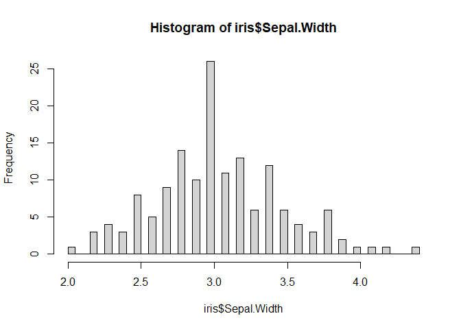

# Introduction

Welcome to your first IB 372 lab!  

In this lab we'll be going over introductory statistics, a topic that will set you up for the data analysis and interperitation you'll be doing throughout the semester and throughout your careers in just about any field going forward.  

We'll go over two major types of statistics, **descriptive** statistics, and **inferential** statistics, as well as covering the basics of how to read data into R, and explore that data with these statistics.  

By the end of this lab, you should be able to apply the described descriptive and inferential statistics to a data set, define common statstical terms, and be able to interperate the output of each analysis described here. For a detailed list of learning outcomes, check out the list at the end of this lab.

# Getting into a data set

For today's lab, you'll be using several data sets that you'll read into R from files we provide, but we'll start out demonstrating a few concepts with a data set provided with every R installation, first off let's use the data set called "iris"  

Because this data set is included with R, we can import it by just using the following code 


```r
#read in the data set called iris
data("iris")
```

This dataset contains measurements on individuals of three different iris species, and was first published by a famous biologist and statistician names Ronald Fisher

Let's get a look at what we actually have data on shall we?


```r
#the dim function tells us the dimensions of our data set, how many rows and columns of data we have
dim(iris)
```

```
## [1] 150   5
```

```r
#we use the head function to see the top few rows of a data set
head(iris)
```

```
##   Sepal.Length Sepal.Width Petal.Length Petal.Width Species
## 1          5.1         3.5          1.4         0.2  setosa
## 2          4.9         3.0          1.4         0.2  setosa
## 3          4.7         3.2          1.3         0.2  setosa
## 4          4.6         3.1          1.5         0.2  setosa
## 5          5.0         3.6          1.4         0.2  setosa
## 6          5.4         3.9          1.7         0.4  setosa
```

We can get a lot of usefull information about our data from just these two functions in R (a function in R is just like a function in your old math class, it's anything that takes one thing in, does something with it, and spits something else out)  

From the output of running dim on our data set, we can see that we have 150 rows of our data set, which corrospond to 150 iris **individuals**, and 5 columns of our data, which corrospond to 5 **variables**, or things that were measured  

This is where I type something super obvious that's important to keep in mind.  

If we take the entire global population of each of these species and count them, there would be more than 150 indviduals, because we're gouping based on species, we would call the group of all individauls of a given species of iris the **population** of that species. A population is just the total number of plants/animals/people that have an attribute of interest. A **parameter** is the real measure of this attribute for the population. We say there are **N** individuals when we're talking about a whole population.

Alternatively, our data set is a **sample** of each of those populations, a subset of the population for which a researcher measures the
attribute. This sample is assumed to be representative of the entire population. A **statistic** is a measure of the attribute for the sample. When we're talking about a sample we say there are **n** individuals.

So for our data set, n=150, it is a sample of the global iris population.

From the output of running head on our data set, we can see that the 5 variables included here are Sepal length, Sepal width, Petal length, Petal width, and species, if you're wondering why there are dots in the names of each variable, it's because including spaces in column names makes it harder to work with in R, keep that in mind as you collect your own data!

We can also see from our head function that we've got two different types of variables here, the first four columns are measurements of length or width. These are called **continuous** variables, they can be any value in an uninterupted range (if you picture a number line, they can be any value on there). Species on the other hand is not a continuous variable, let's see if there are any values other than setosa, which is all we see in the first few lines.


```r
#we use unique to get all the unique values in a set a of data
#the $ after iris tells R we want a column within that data set, in this case, species
unique(iris$Species)
```

```
## [1] setosa     versicolor virginica 
## Levels: setosa versicolor virginica
```

We see here that we've got three "levels" of this variable, but they aren't numbers like our other variables. This is what's called a **nominal discrete** variable, which just means a variable where only certain values are possible (the species of iris), and the options, or levels, don't have a meaninful order. If there were a meaningful order to our possible values, we would have an **ordered discrete** variable, which could be something like shoe size, it's a number, and each size fits into an order, however there are a limited number of possible values.

# Descriptive statistics

Now that we have a data set, and understand what we're looking at, let's start to get an idea of what our data look like quantiatively. When we're not looking to answer a specific, quantitative question, like "are the sepals of species A longer than the sepals of species B", then use what we call **descriptive** statistics, these are values like **mean**, **median**, and **mode**, that just give us a way to quantitatively describe our data.  

The best way to get started looking at a data set, is with just a simple histogram and R makes this really easy for us. Here we're going to make a histogram of our sepal width


```r
#the hist function allows us to draw a histogram of a data set
hist(iris$Sepal.Width)
```

<!-- -->

This is useful because it allows us to get a look at how our data is dstributed across the range of values represented, and give us a qualitiative idea of what we're looking at.  

As a brief, but important tangent, it's always important to keep in mind how you're visualizing your data, as well as what data your visualizing. With histograms the biggest factor to consider is, how are we breaking up our data, or how wide a range of values are we grouping together. This is important because if don't have enough groups we may clump too many individausl together and it can be hard to notice a pattern.


```r
#we can use the breaks argument in hist to tell it how many breaks we want in our histogram
hist(iris$Sepal.Width, breaks = 3)
```

<!-- -->

Here we don't break up our data enough and we miss out on the major structure of our data (that it's approximatly normally distributed, but we'll get to that soon!). Alternatively, if we break up our data too much, we can notice patterns that aren't particularly meaningful (this is a judgement call that you'll get better at as you spend more time with real data sets!).


```r
hist(iris$Sepal.Width, breaks = 45)
```

<!-- -->

Now we can see the same main pattern as we did in our original histogram, however we also see a lot more rises and drops from column to column. It doesn't take away too much from the main pattern in this case, but it can throw us off of a meaningful signal in our data when we have messier data sets. How many breaks you include in a histogram is your choice, but always try out a few different ways to break up your data to make sure you're getting a real signal and not missing anything!  

Now lets learn what values we can find for our data to start to understand what we're looking at!

## Measures of central tendeny

The first set of descriptive statistics we'll look at here are what are called **measures of central tendency**, which is really a fancy term for all the things your third grade math teacher called averages, we'll look at **mean**, **median**, and **mode**.

The most important of these values is the **mean**, which for a **population** is called $\mu$, and for a **sample** is called $\bar{x}$, you're all probobly fermiliar with the formula for mean, but as a refresher it's defined as the following for a sample:  
$$ \bar{x} = \frac{\sum_{i=1}^n x_i}{n} $$
Or, in english, just the sum of all the values devided by the number of values.

The **median** is just the middle value in a set of data, if you'r data is in order and you have an odd number of values, the median is just the value in the middle, or the $\frac{n+1}{2}th$ value, so $$ M_{odd} = x_\frac{n+1}{2}$$  
If you've got an even number of values, because you may not have one value in the middle, you take the average of the two numbers closest to the middle, so $$M_{even} = \frac{x_\frac{n}{2}+x_\frac{n+1}{2}}{2}$$

The **mode**, on the other hand, is the most common value in a data set.

For example, if we've got a data set of the values: $$1,1,1,1,4,5,6,6,7,7,7,8,9,10$$
then the **mean** = 5.214286
the **median** = 6
and the **mode** = 1

If our data are **normally** distributed, think a symetrical bell curve, the mean is just at the peak of a histogram of the data, to demonstrate that, here's a plot of some randomly simulated normal data, with a red line representing the mean.


```r
#first we generate a random dataset of 100000 values from a noramal distribution
#note that the <- assigns a value to a variable
x <- rnorm(100000)

#then we take it's mean
xBar <- mean(x)

#we draw a histogram of the data
hist(x, main = "Normal data with mean")

#and add a line to the plot where the mean is
abline(v=xBar, col="red", lwd=2)
```

<!-- -->

Interestigly, if the data is normal then the mode and median are also rigth in the middle where the highest frequency is, it takes a little buit of code that I'd rather not complicate things with for this example to get the mode of our data in R, so I'm going to leave out a plot with the mode, but here's one with the mdedian in blue


```r
#get the median of the data and assign it to xMed
xMed <- median(x)

#we draw a histogram of the data
hist(x, main = "Normal data with Median")

#and add a line to the plot where the median is
abline(v=xMed, col="blue", lwd=2)
```

<!-- -->

While measures of central tendancy don't tell us much about how our data are actually distributed, they can tell us if our data is **skewed**, basically just weather or not our data are perfectly semetrical. If our **mean, median, and mode are all equal**, then we know our data are symetrical and **not skewed** in the negative or positive direction, if our **mean is lower than our median and mode** then we call our data **negatively skewed**, and if our **mean is higher than our median and mode**, we say our data is **positively skewed**, don't worry too much about knowing the specifics of each of these terms, just know that not all data are symetrical, and if they aren't we say they're skewed.

That's all the measures of central tendancy you need to know, so now let's move on to measures of dispersion

## Measures of dispersion

While we can tell a lot from the mean, median, and mode of a data set, it's important to remember that they don't tell us everything about how our data is distributed across its **range** - $x_{max}-x_{min}$, for example, these three plots all have the same exact mean, median, and mode, but if you got these three data sets, you'd know something was different between them  


```r
#least dispersion
x <- seq(-10, 10, length=1000)
y <- dnorm(x, mean=0, sd=.75)
plot(x, y, type="l", lwd=1)
```

<!-- -->

```r
#medium dispersion
x <- seq(-10, 10, length=1000)
y <- dnorm(x, mean=0, sd=2)
plot(x, y, type="l", lwd=1)
```

<!-- -->

```r
#most dispersion
x <- seq(-10, 10, length=1000)
y <- dnorm(x, mean=0, sd=3)
plot(x, y, type="l", lwd=1)
```

<!-- -->
You'd be right in thinking they are different because they all have different **standard deviations**  

**Standard deviation**, generally represented as $\sigma$ for a population or $s$ for a sample, is a measure of how spread out our data is, it's really useful for understanding the normal distrubution, which I'll talk about in just a second.  

While **standard deviation** is great, and has a straight forward interpritation, we rarely calculate it directly, it's actually easier to calculate the squared **standard deviation**, which we call **variance** ($\sigma^2$ for a population, or $s^2$ for a sample). The formula for variance is $$s^2=\frac{\sum_{i=1}^{n}(x_i-\bar{x})^2}{n-1}$$  
but we won't hold you responsible for having this memorized  

The reason **standard deviation** is so useful is it allows us to translate knowing that our data is normal, into knowing what proportion of our data is where, for example in a perfect, normal data set, we know that 68.2% of our data falls within one standard devation of the mean, a 95% chance it falls within 2 standard deviations ,and there's only a 0.2% chance of getting a value more than 3 standard deviations from the mean. Here are the same plots as above but with lines drawn in blue at one standard deviation out, in red at two standard deviations out, and in green at three standard deviations out.


```r
#least dispersion
x <- seq(-10, 10, length=1000)
y <- dnorm(x, mean=0, sd=.75)
y.stDev <- .75
plot(x, y, type="l", lwd=1)
abline(v=y.stDev, col="blue", lwd=2)
abline(v=-y.stDev, col="blue", lwd=2)
abline(v=2*y.stDev, col="red", lwd=2)
abline(v=-2*y.stDev, col="red", lwd=2)
abline(v=3*y.stDev, col="green", lwd=2)
abline(v=-3*y.stDev, col="green", lwd=2)
```

<!-- -->

```r
#medium dispersion
x <- seq(-10, 10, length=1000)
y <- dnorm(x, mean=0, sd=2)
y.stDev <- 2
plot(x, y, type="l", lwd=1)
abline(v=y.stDev, col="blue", lwd=2)
abline(v=-y.stDev, col="blue", lwd=2)
abline(v=2*y.stDev, col="red", lwd=2)
abline(v=-2*y.stDev, col="red", lwd=2)
abline(v=3*y.stDev, col="green", lwd=2)
abline(v=-3*y.stDev, col="green", lwd=2)
```

<!-- -->

```r
#most dispersion
x <- seq(-10, 10, length=1000)
y <- dnorm(x, mean=0, sd=3)
y.stDev <- 3
plot(x, y, type="l", lwd=1)
abline(v=y.stDev, col="blue", lwd=2)
abline(v=-y.stDev, col="blue", lwd=2)
abline(v=2*y.stDev, col="red", lwd=2)
abline(v=-2*y.stDev, col="red", lwd=2)
abline(v=3*y.stDev, col="green", lwd=2)
abline(v=-3*y.stDev, col="green", lwd=2)
```

<!-- -->

In addition to **range**, **standard deviation**, and **variance**,  it's also helpful to have an undersanding of **standard error**, while we won't spend much time on it here, standard error gives us a value to compare how well a sample mean estimates the population mean, it's value is $$\frac{s}{\sqrt{n}}$$  
so the larger our sample the smaller it is, and the higher our standard deviation, the larger it is

## Now with iris data!

Let's take what we've learned about descriptive statistics, and apply them to our sepal length data for our iris species!

First, let's get measures of central tendancy.

# Detailed list of learning outcomes
